<p align="center">
  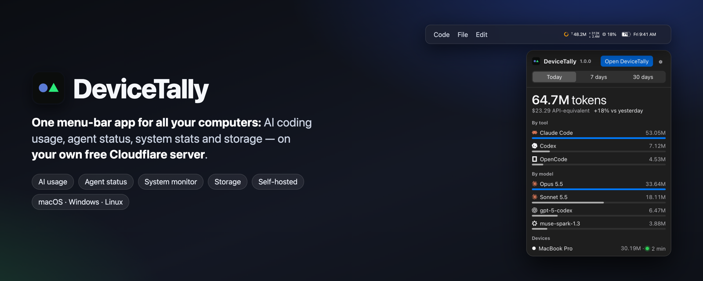
</p>

<h1 align="center">DeviceTally: one menu-bar app for all your computers</h1>

<p align="center">
  <a href="https://github.com/bipul0525/devicetally/releases/latest"></a>
  
  
  <a href="LICENSE"></a>
</p>

<p align="center"><b>AI coding usage, agent status, system stats and storage — for every Mac, Windows and Linux computer you use.</b><br>
Claude Code, Codex, OpenCode and Kimi usage · know when your agent is done · a menu bar you design · storage cleanup · free and private on your own Cloudflare account.</p>

**DeviceTally** is a free, open-source, self-hosted **menu-bar app for all your computers**:

- **AI coding usage:** tokens and API-equivalent cost from Claude Code, OpenAI Codex, OpenCode and Kimi, by model, project and computer. Think of [ccusage](https://github.com/ryoppippi/ccusage) for every computer you own.
- **Agent status:** know when your AI coding agent is working, needs you, or is done, with Mac notifications and sounds.
- **System monitor:** CPU, temperature, memory, network, disk and battery, each in its own menu-bar item with a detailed panel, like Stats.
- **Storage:** see what AI models, developer caches and big folders use, and clear caches safely.
- **Device health:** every computer's status, disk forecast and tracking at a glance.

It runs on your own free Cloudflare Worker, so your data stays yours. More tools are on the way.

<p align="center">
  <a href="#install">Install</a> ·
  <a href="#install-with-an-ai-agent">Install with an AI agent</a> ·
  <a href="#features">Features</a> ·
  <a href="#how-it-works">How it works</a> ·
  <a href="#faq">FAQ</a>
</p>

---

## Every menu-bar item opens its own panel

<p align="center">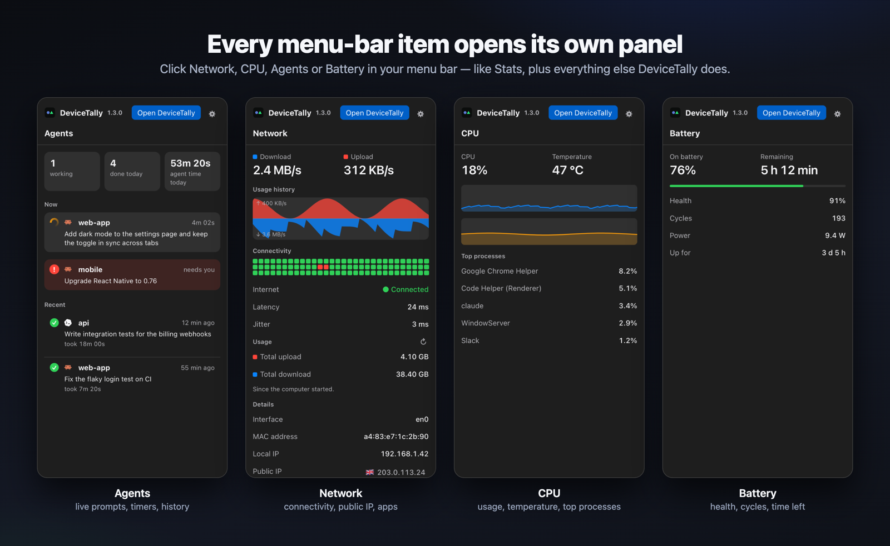</p>

Network, CPU, memory, disk, battery, clock and your coding agents each get **their own menu-bar item**, and each opens **its own panel**, like [Stats](https://github.com/exelban/stats), next to your AI usage, agent status and storage. Prefer one item? Turn on **Combine into one item**.

## Know when your agent is done

Start a task in Claude Code, switch to something else. **Agent status** in your menu bar moves while it works, shows **!** when it needs you (a permission or a question), and **✓** when it's done, with a notification that names the prompt (*"Done: Fix the flaky login test · took 7 min"*) and a sound. It works in the terminal, in VS Code and in other editors. Codex too.

<p align="center">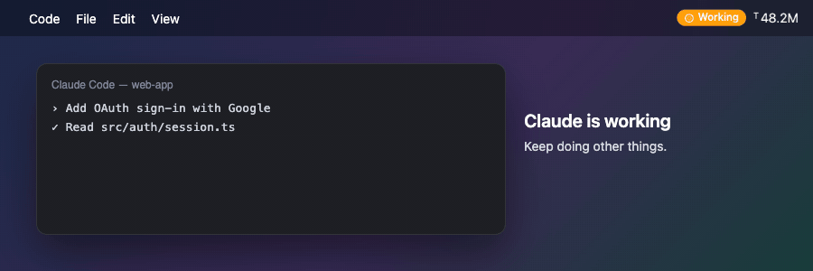</p>

<table>
<tr>
<td width="42%" valign="top">

### The Agents panel
What each agent is working on **right now** (its prompt, with a live timer), what **needs you**, and a **history** of finished tasks with how long each took. Today's count and agent time at the top.

</td>
<td width="58%" valign="top">

### Pick a look
While working: a **comet ring**, a **breathing pulse** or **wave dots**. When done: a closed **ring** with a check, a **dot** or a **spark**. In the menu bar's own colour, or orange / red / green.

</td>
</tr>
<tr>
<td align="center">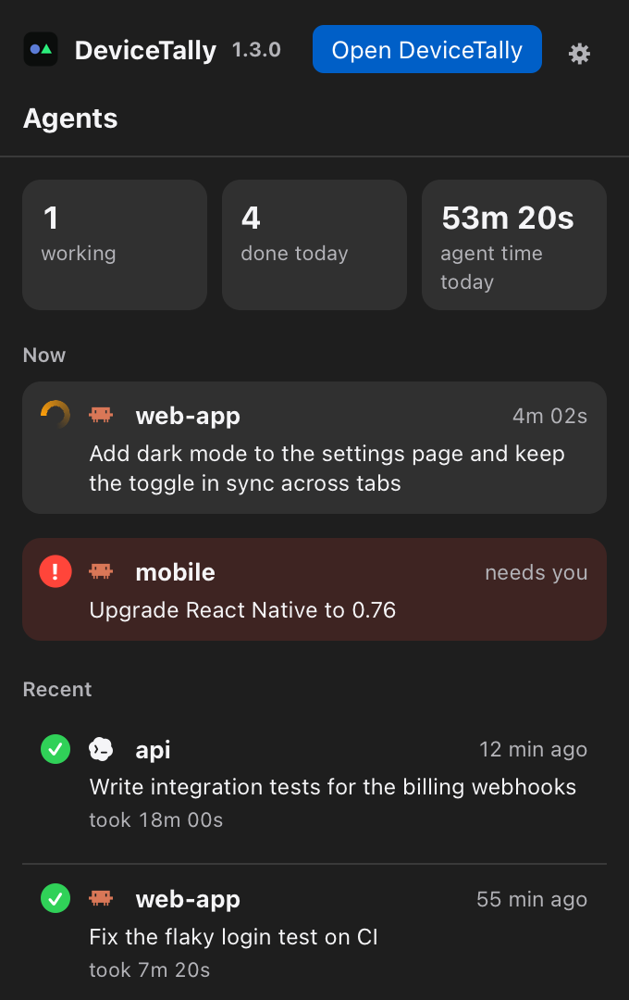</td>
<td>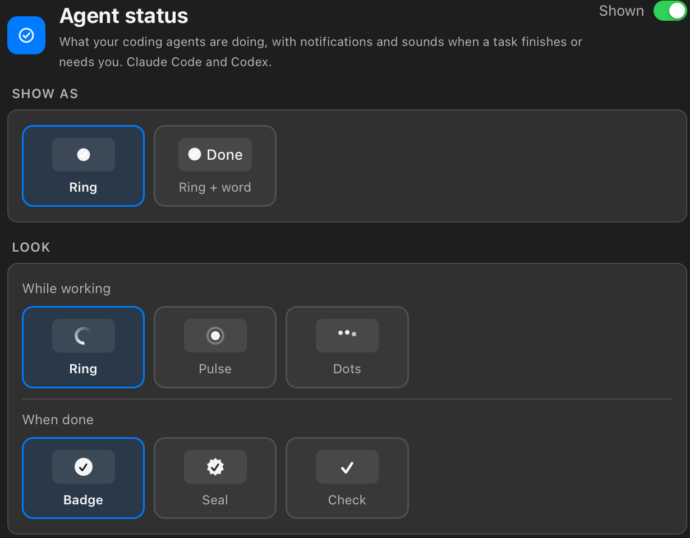</td>
</tr>
</table>

<p align="center">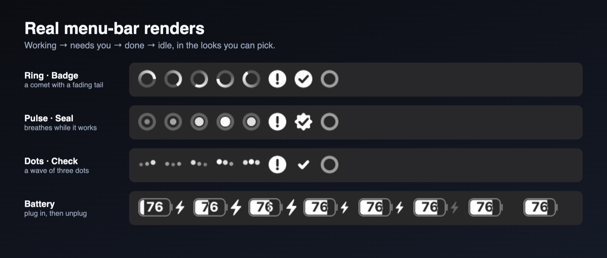</p>

## Features

<table>
<tr>
<td width="50%" valign="top">

### Usage across every computer
Tokens and API-equivalent cost by **tool, model, project and computer**, with a day-by-day chart split by device. Claude Code in detail (input, output, cache, thinking; cost matches [ccusage](https://github.com/ryoppippi/ccusage)), plus Codex, OpenCode and Kimi. Each computer sees its own full breakdown; the admin sees all of them.

</td>
<td width="50%" valign="top">

### A menu bar you design
Every item's label (text, SF Symbols icon or none), layout, size (50–200%), colour and spacing. 12 fonts, a live preview, **battery with the percentage inside** (with a charger animation), a digital or analog clock.

</td>
</tr>
<tr>
<td>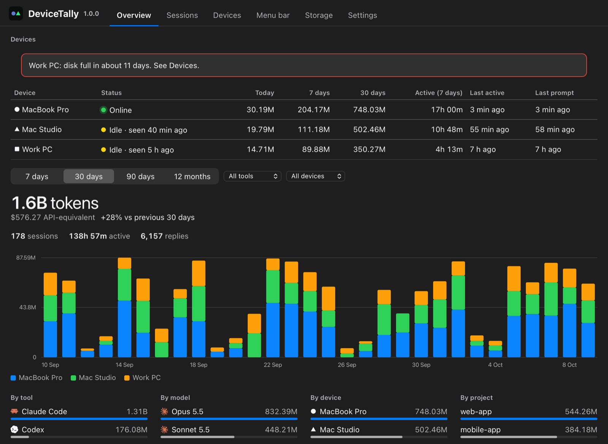</td>
<td>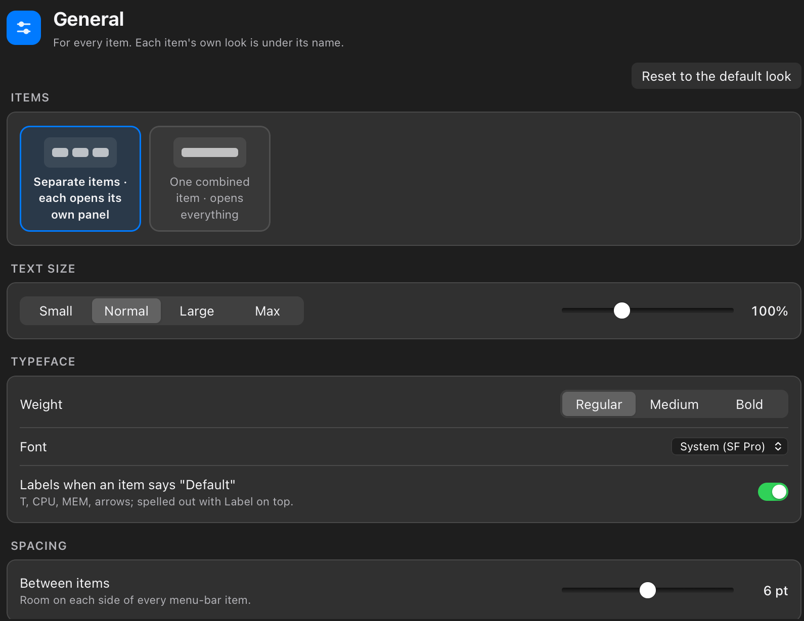</td>
</tr>
<tr>
<td valign="top">

### Network, like Stats
Upload and download history, a **connectivity grid** with latency and jitter, totals you can reset, interface, MAC, local and **public IP** (with country and provider), DNS, and the **apps using the network** right now.

</td>
<td valign="top">

### Storage
What AI tools (Ollama models, Hugging Face, Claude Code, Cursor…), developer caches (Xcode, npm, Cargo, Go…) and big folders use, **how much is safe to clean**, a Safe / Caution / Risky label, **Show in Finder** and **Move to Bin** for caches. No permission pop-ups.

</td>
</tr>
<tr>
<td align="center">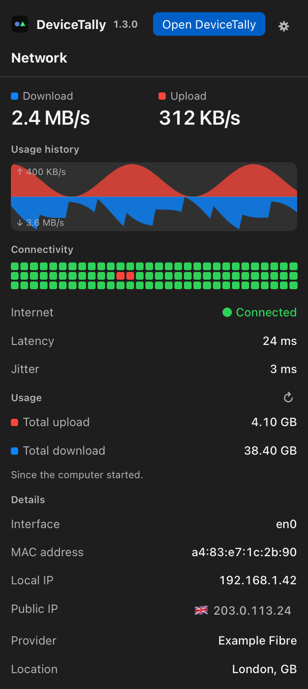</td>
<td>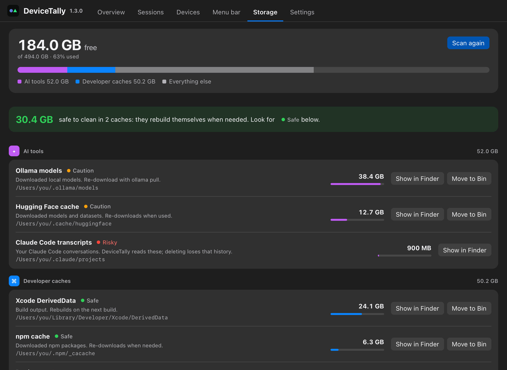</td>
</tr>
<tr>
<td valign="top">

### Device health
Every computer shows **Online / Idle / Offline**, whether it's 🔒 locked, tracking problems (hooks missing, paused, transcripts deleted), its disk with a *"full in about N weeks"* estimate, and the projects it's meant for.

</td>
<td valign="top">

### Prompts, if you want them
The admin can collect prompt text (off by default) and browse it by day, with the date, device, project and agent, and filter by text, time range, project or device.

</td>
</tr>
<tr>
<td>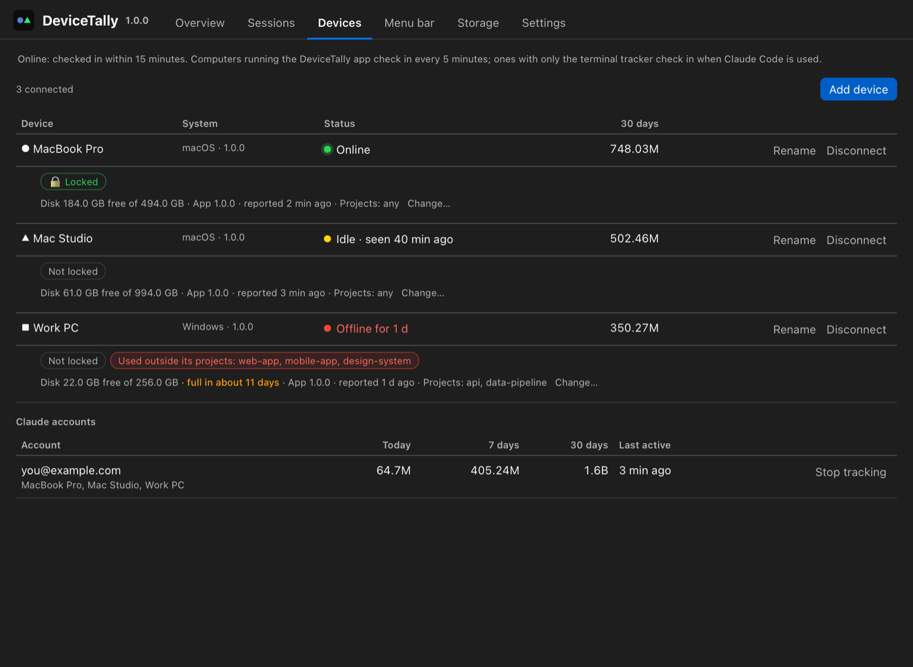</td>
<td>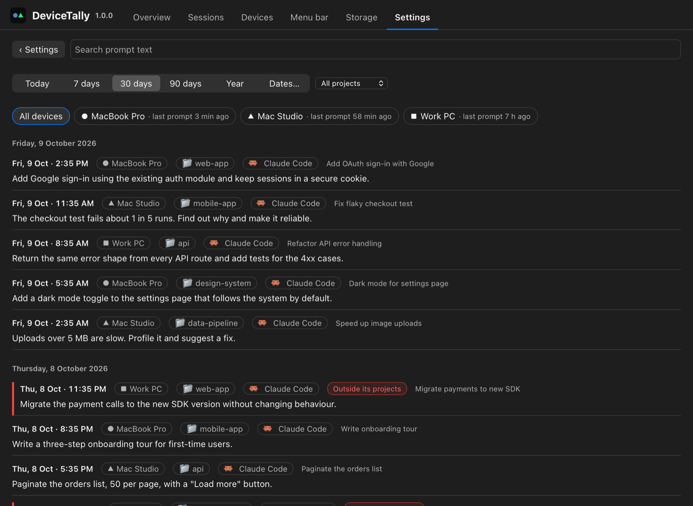</td>
</tr>
</table>

**Also:** in-app updates (signed and verified), a disconnect request flow (joined computers can't remove themselves), allowed projects per computer, **Lock this computer** (macOS), export and delete, several servers, and Windows and Linux apps.

<p align="center">
  <picture>
    <source media="(prefers-color-scheme: dark)" srcset="docs/assets/menubar-dark.png">
    
  </picture>
  &nbsp;&nbsp;&nbsp;
  <picture>
    <source media="(prefers-color-scheme: dark)" srcset="docs/assets/menubar-stats-dark.png">
    
  </picture>
  <br><sub>Real menu-bar renders: the default style, and a stats-style layout with labels on top.</sub>
</p>

## How it compares

| | DeviceTally | ccusage | tokscale | Stats |
|---|---|---|---|---|
| Claude Code tokens and cost | ✅ in detail | ✅ | ✅ | — |
| Codex, OpenCode, Kimi | ✅ | partly | ✅ | — |
| **Several computers in one view** | ✅ | — (one machine) | — (one machine) | — |
| Menu bar app | ✅ | — (CLI) | — (CLI) | ✅ |
| Agent status: working / needs you / done | ✅ | — | — | — |
| CPU, memory, network, disk, battery in the menu bar | ✅ | — | — | ✅ |
| Your data stays in your account | ✅ (your Cloudflare) | ✅ (local) | ✅ (local) | ✅ (local) |

DeviceTally uses tokscale for the other tools and matches ccusage's cost per model. If you use one computer and want a quick terminal report, ccusage is great. DeviceTally is for **several computers, a team of your own devices, and a menu bar that tells you when the agent is done**.

## How it works

<p align="center">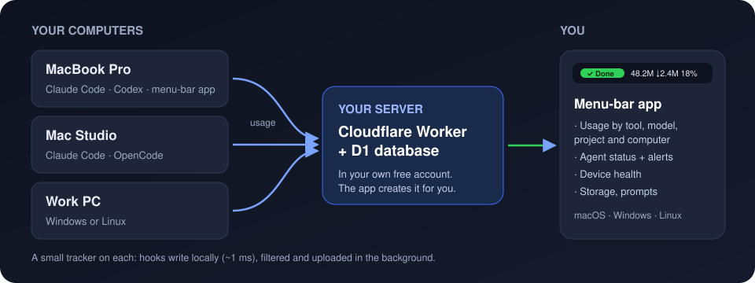</p>

- **A small tracker on each computer.** Claude Code hooks only write a line locally (about 1 ms), and uploads happen in the background, so Claude Code never slows down. Offline? Nothing is lost; it's sent later.
- **Your own server.** A Cloudflare Worker with a D1 database in **your** free Cloudflare account. The app creates it for you in about 3 minutes, with no terminal needed. Nobody else holds your data.
- **Filtered on your computer first.** Only accounts you approve are tracked, secrets are redacted, and prompt text is only collected if you turn it on.

## Install

| Your computer | Download from the [latest release](https://github.com/bipul0525/devicetally/releases/latest) |
|---|---|
| Mac with Apple Silicon (M1, M2, M3, M4…) | `DeviceTally_…_mac-apple-silicon.dmg` |
| Mac with Intel | `DeviceTally_…_mac-intel.dmg` |
| Windows | `DeviceTally_…_windows-setup.exe` |
| Linux | `DeviceTally_…_amd64.AppImage` (any distribution) or `.deb` (Ubuntu, Debian) |

Not sure which Mac? Apple menu → **About This Mac**: "Chip Apple M…" means Apple Silicon.

**macOS:** open the `.dmg`, drag **DeviceTally** into **Applications**, then paste this into Terminal and press Return:
```sh
xattr -dr com.apple.quarantine /Applications/DeviceTally.app
```
DeviceTally isn't signed with a paid Apple certificate, so macOS otherwise says *"DeviceTally is damaged"*. It isn't damaged: the command only removes the "downloaded from the internet" mark. If you already saw the message, click **Cancel** (not Move to Bin), run the command, and open the app again.

**Or install with one command,** on Mac or Linux (no warning, nothing else to run):
```sh
curl -fsSL https://raw.githubusercontent.com/bipul0525/devicetally/main/scripts/install-app.sh | sh
```

**Windows:** run the `windows-setup.exe`. If SmartScreen warns, click **More info → Run anyway**.

### Install with an AI agent

Paste this into Claude Code, Codex or another coding agent on the computer you want to set up:

```text
Install the DeviceTally app from https://github.com/bipul0525/devicetally on this computer.

1. Detect my OS and CPU.
2. macOS or Linux: run
   curl -fsSL https://raw.githubusercontent.com/bipul0525/devicetally/main/scripts/install-app.sh | sh
   (it picks the right build, installs it and opens it; on macOS it avoids the "damaged" warning).
3. Windows: in PowerShell, find the asset ending in "_windows-setup.exe" in
   https://api.github.com/repos/bipul0525/devicetally/releases/latest, download it to my
   Downloads folder and run it (`/S` for a silent install), then open DeviceTally from the Start menu.
4. Check the app is running and tell me its version (shown in the app's title bar).
5. Then tell me the next step in the app, without doing it for me:
   - first computer: "Set up DeviceTally" (needs my Cloudflare account and a token I create),
   - another computer: "Join with a code" (from Devices → Add device on my first computer).
Don't create Cloudflare tokens, passwords or accounts for me, and don't change any other settings.
```

## Set up

Open DeviceTally and choose:

- **Just this computer**: no server and no account. Your AI usage (Claude Code, Codex, OpenCode, Kimi), agent status, system monitor and storage, counted on this computer; nothing leaves it. You can connect to a server later (Settings), and the history kept so far uploads.
- **Set up DeviceTally**, on your first computer. The app walks you through it:
  1. Create a free [Cloudflare account](https://dash.cloudflare.com/sign-up) if you don't have one.
  2. Click **Open Cloudflare's token page**. The right permissions are already filled in: click **Continue to summary**, **Create Token**, **Copy**, and paste the token into the app. It's used once and never stored. (If the page doesn't open, use **Copy link** and paste it into the browser where you're signed in to Cloudflare.)
  3. The app creates your private server and shows its progress.
  4. Choose your admin email and password. This computer is connected, and its history uploads.
- **Join with a code**, on each other computer. On your first computer, go to **Devices → Add device** and copy the message it shows (server address plus a 6-letter code, valid 15 minutes). Enter both on the new computer. The same screen also shows a one-line terminal command, for computers without the app.
- **Sign in as admin**, to manage DeviceTally from another computer too.

**Updates:** a new version shows a card with **Update now** / **Later**, or installs itself when DeviceTally isn't in use if **Update automatically** is on (Settings). Admins can make updates automatic for joined computers, and update one from **Devices → Update now**.

Then open the **Menu bar** tab to design your menu-bar item. Using DeviceTally's battery or clock? Hide macOS's own in **System Settings → Control Center**.

## Admin tasks

| To… | Go to |
|---|---|
| Add a computer | **Devices → Add device** (copy the invite message) |
| Track or ignore a Claude account | **Devices → Claude accounts** → **Track** / **Ignore** |
| Say which projects a computer is for | **Devices** → *Projects: Change…* (work elsewhere is flagged) |
| Approve a computer's request to disconnect | **Devices** → **Approve** / **Decline** |
| Make tracking impossible to turn off | On that computer, signed in as admin: **Settings → Lock this computer** (macOS, asks for the Mac's admin password; works fully on a standard, non-admin account) |
| Turn on Codex, OpenCode or Kimi | **Settings → Other AI tools** |
| Collect prompt text or not, retention | **Settings → Tracking** |
| Read prompts | **Settings → Data → View prompts** |
| Export or delete data | **Settings → Data** |
| Update your server | The **Update server** banner (asks for a Cloudflare token, used once) |
| Manage another server | **Settings → Add server…** |
| Stop using DeviceTally | **Settings → Stop using DeviceTally** (deletes your server and data in Cloudflare) |

## Updates

- **App:** updates itself (**Settings → App → Check for updates**), verified with DeviceTally's signing key before installing.
- **Server:** has its own version and changes rarely. When an app update needs a newer server, the app shows **Update server**.
- **Tracker:** updates itself at most once a day, checksum-verified.

## FAQ

<details><summary><b>Is it free?</b></summary>

Yes. DeviceTally is MIT-licensed, and it runs on Cloudflare's free plan. One person with 3 to 5 busy computers uses a few thousand requests a day (the limit is 100,000) and about 12,000 database writes (the limit is 100,000).
</details>

<details><summary><b>Who can see my data?</b></summary>

Only you. It lives in your own Cloudflare account. Joined computers see only their own usage, and prompt text is visible only to the admin, only if they turned collection on. Details: [docs/privacy.md](docs/privacy.md).
</details>

<details><summary><b>Does it slow Claude Code down?</b></summary>

No. Hooks run asynchronously and only append a line to a local file. Uploads happen in a separate background process.
</details>

<details><summary><b>Which tools and models are supported?</b></summary>

Claude Code in full detail. Codex, OpenCode and Kimi as token totals per model (via [tokscale](https://github.com/junhoyeo/tokscale)). Agent status: Claude Code (working, needs you, done) and Codex (done).
</details>

<details><summary><b>Advanced: create the server from the terminal</b></summary>

Needs [Node.js](https://nodejs.org) 22+ and git.
```sh
git clone https://github.com/bipul0525/devicetally && cd devicetally/worker
npm ci && npx wrangler login && npm run setup
```
Then, in the app: **Sign in as admin** → tick **First time on this server** → enter the address and setup token it printed, plus your email and password.
</details>

<details><summary><b>Tracker commands</b> (on each connected computer)</summary>

```
devicetally status            connection, last sync, other tools
devicetally sync              upload now
devicetally pause | resume    stop / restart tracking on this computer
devicetally update            install the latest tracker (checksum-verified)
devicetally update --rollback undo the last update
devicetally uninstall         remove the hooks (restoring Claude's settings) and local data
```
</details>

## Development

```sh
cd agent && go test ./...              # tracker (Go)
cd worker && npm ci && npm test        # server (Cloudflare Worker, runs in workerd)
cd app && npm ci && npm run app        # app (Tauri: Rust + Preact); tests: cargo test in app/src-tauri
```

**Try the app locally before releasing:** quit DeviceTally, then `cd app && npm run try`. The real app opens with your own data; UI changes in `app/src` show up as soon as you save, and changes in `app/src-tauri` rebuild and restart it (20–60 s). Press Ctrl+C in the terminal to stop.

See [CONTRIBUTING.md](CONTRIBUTING.md), [SECURITY.md](SECURITY.md) and [CHANGELOG.md](CHANGELOG.md). Design notes are in [docs/dev](docs/dev).

## Credits

[ccusage](https://github.com/ryoppippi/ccusage) (cost reference), [tokscale](https://github.com/junhoyeo/tokscale) (other tools), [ClearDisk](https://github.com/bysiber/cleardisk) (cache locations), [Simple Icons](https://simpleicons.org) and [LobeHub Icons](https://github.com/lobehub/lobe-icons) (brand marks), [Tauri](https://tauri.app), [Hono](https://hono.dev).

## License

MIT. DeviceTally is an independent project and is not affiliated with Anthropic, OpenAI or Cloudflare.
